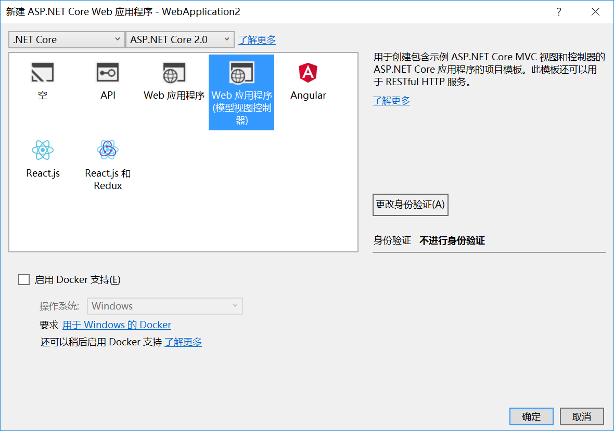
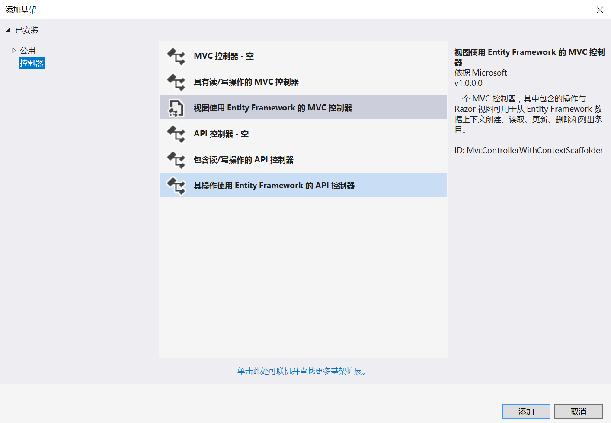
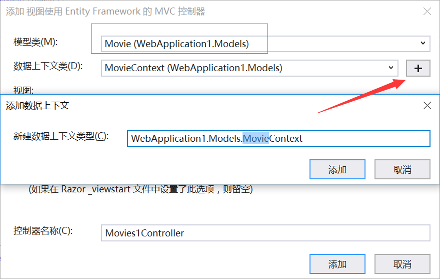
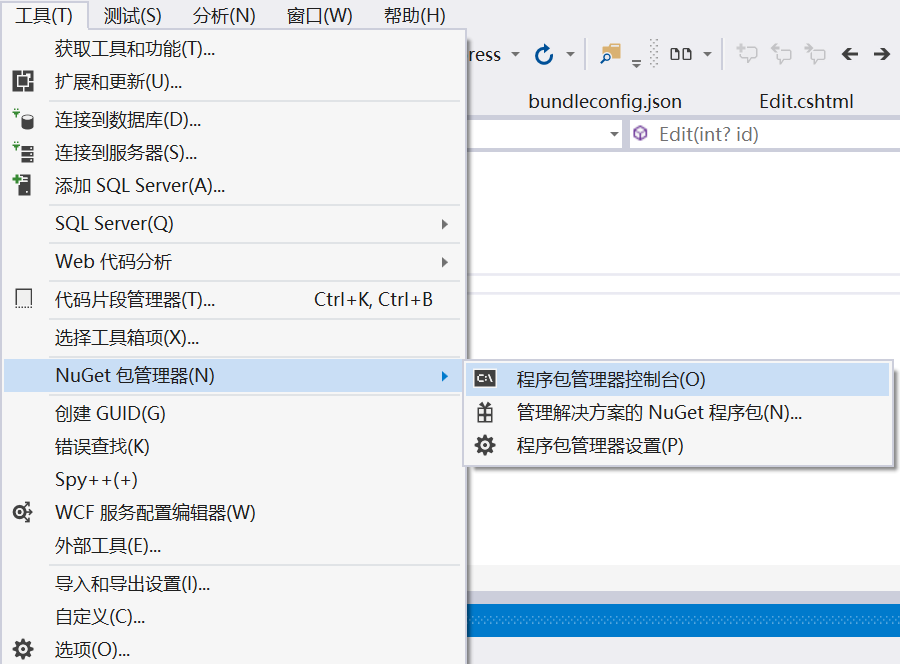
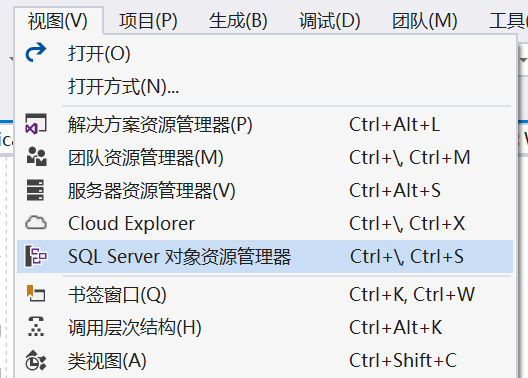
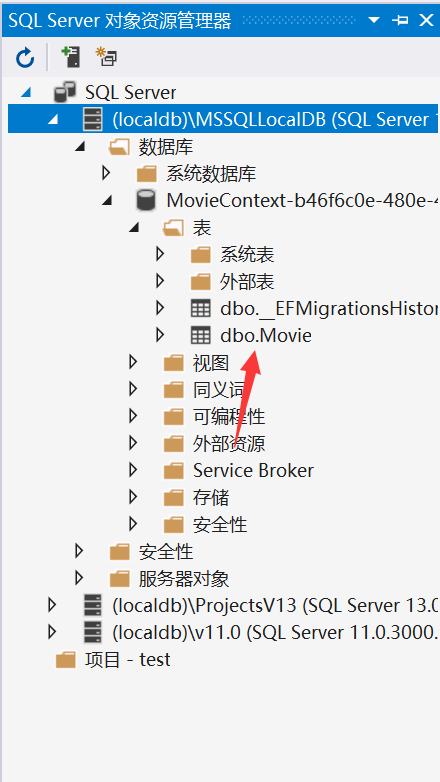

在 Razor页码增删改查项目中 是手动来新建各种页面和 DbContext的

Core 其实也是可以用EF 来自动创建

### Code  First

新建一个`Asp.net Core Web 应用程序`  选择 `Web应用程序(模型视图控制器)`




如其名，这种是就是跟MVC一样 是有`Controller`、`Models`跟`Views` 

`Models`下面新建 Movies.cs类

```c#
public class Movie
{
  public int ID { get; set; }
  public string Title { get; set; }
  public DateTime ReleaseDate { get; set; }
  public string Genre { get; set; }
  public decimal Price { get; set; }

}
```


#### 添加数据库链接配置

在`appsettings.json` 中新增

```json
"ConnectionStrings": {
    "MovieContext": "Server=(localdb)\\mssqllocaldb;Database=MovieContext-b46f6c0e-480e-483c-b789-28e8f6c54cdc;Trusted_Connection=True;MultipleActiveResultSets=true"
  }
```


#### 添加控制器



 同时也会让添加一个DBContext




#### 添加EF工具并且执行初始迁移




在Nuget 包管理控制台(PM)中依次输入：

```c#
Install-Package Microsoft.EntityFrameworkCore.Tools
Add-Migration Initial
Update-Database
```

完成后，在VS =>视图=>Sql Server 对象管理资源 窗口中可以查看到刚才新增的数据库







运行项目 浏览器输入:

```
http://localhost:58500/Movies/Index
```

新增数据数据 数据库可以正常保存数据


### DB First

创建数据库

```mssql
CREATE DATABASE [Blogging];
GO

USE [Blogging];
GO

CREATE TABLE [Blog] (
    [BlogId] int NOT NULL IDENTITY,
    [Url] nvarchar(max) NOT NULL,
    CONSTRAINT [PK_Blog] PRIMARY KEY ([BlogId])
);
GO

CREATE TABLE [Post] (
    [PostId] int NOT NULL IDENTITY,
    [BlogId] int NOT NULL,
    [Content] nvarchar(max),
    [Title] nvarchar(max),
    CONSTRAINT [PK_Post] PRIMARY KEY ([PostId]),
    CONSTRAINT [FK_Post_Blog_BlogId] FOREIGN KEY ([BlogId]) REFERENCES [Blog] ([BlogId]) ON DELETE CASCADE
);
GO

INSERT INTO [Blog] (Url) VALUES
('http://blogs.msdn.com/dotnet'),
('http://blogs.msdn.com/webdev'),
('http://blogs.msdn.com/visualstudio')
GO
```


#### 创建项目

- 新建一个 Asp.net Core Web 应用 ，选择“ASP.NET Core Web 应用程序(.NET Core)”项目模板
- 选择“Web 应用程序(模型视图控制器)”


#### 安装Entity FrameWork

工具”>“NuGet 包管理器”>“包管理器控制台”

```
Install-Package Microsoft.EntityFrameworkCore.SqlServer
```

我们将使用一些 Entity Framework Tools 从数据库创建模型。We will be using some Entity Framework Tools to create a model from the database. 因此，我们也会安装此工具包

```
Install-Package Microsoft.EntityFrameworkCore.Tools
```

我们稍后将使用一些 ASP.NET Core 基架工具来创建控制器和视图。We will be using some ASP.NET Core Scaffolding tools to create controllers and views later on. 因此，我们也会安装此设计包

```
Install-Package Microsoft.VisualStudio.Web.CodeGeneration.Design
```


#### 创建实体模型

工具”>“NuGet 包管理器”>“包管理器控制台”

```
Scaffold-DbContext "Server=(localdb)\mssqllocaldb;Database=Blogging;Trusted_Connection=True;" Microsoft.EntityFrameworkCore.SqlServer -OutputDir Models
```

这个时候 项目中Models里面多了 Blog跟Post 两个实体类

然后就创建DbContext,添加 链接字符串就行了

[MSDN参考地址](https://docs.microsoft.com/zh-cn/ef/core/get-started/aspnetcore/existing-db)

