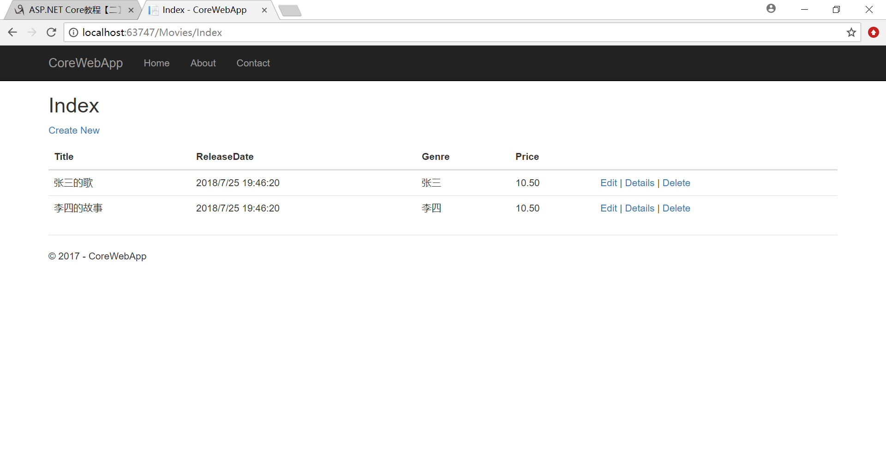

### 新增Model

新建**Models**文件夹 然后新增Model.cs

```c#
namespace CoreWebApp.Models
{
    public class Movie
    {
        public int ID { get; set; }
        public string Title { get; set; }
        public DateTime ReleaseDate { get; set; }
        public string Genre { get; set; }
        public decimal Price { get; set; }

    }
}
```

添加DBContext

```c#
namespace CoreWebApp.Models
{
    public class MovieContext : DbContext
    {
        public MovieContext(DbContextOptions<MovieContext> options)
                : base(options)
        {
            
        }

        public DbSet<Movie> MovieList { get; set; }
    }

}
```


在Startup.cs中注册DbContext

```c#
public void ConfigureServices(IServiceCollection services)
{
  services.AddDbContext<MovieContext>(opt =>
                                      opt.UseInMemoryDatabase("MovieList"));
  services.AddMvc();
}
```


### 新增Index.cshtml

在pages文件夹里面新增一个  Movies 文件夹，然后再Movies里面新增一个 Razor页面，叫做Index.cshtml

注意:在创建Razor视图的窗口，默认是勾选 **生成PageModel类**的 这个不要取消掉了

修改Index.cshtml

```html
@page
@model CoreWebApp.Pages.Movies.IndexModel

@{
    ViewData["Title"] = "Index";
}

<h2>Index</h2>

<p>
    <a asp-page="Create">Create New</a>
</p>
<table class="table">
    <thead>
        <tr>
            <th>
                @Html.DisplayNameFor(model => model.Movie[0].Title)
            </th>
            <th>
                @Html.DisplayNameFor(model => model.Movie[0].ReleaseDate)
            </th>
            <th>
                @Html.DisplayNameFor(model => model.Movie[0].Genre)
            </th>
            <th>
                @Html.DisplayNameFor(model => model.Movie[0].Price)
            </th>
            <th></th>
        </tr>
    </thead>
    <tbody>
        @foreach (var item in Model.Movie)
        {
            <tr>
                <td>
                    @Html.DisplayFor(modelItem => item.Title)
                </td>
                <td>
                    @Html.DisplayFor(modelItem => item.ReleaseDate)
                </td>
                <td>
                    @Html.DisplayFor(modelItem => item.Genre)
                </td>
                <td>
                    @Html.DisplayFor(modelItem => item.Price)
                </td>
                <td>
                    <a asp-page="./Edit" asp-route-id="@item.ID">Edit</a> |
                    <a asp-page="./Details" asp-route-id="@item.ID">Details</a> |
                    <a asp-page="./Delete" asp-route-id="@item.ID">Delete</a>
                </td>
            </tr>
        }
    </tbody>
</table>

```

在 Index.cshtml.cs文件中

```c#
 public class IndexModel : PageModel
    {

        private readonly MovieContext _context;

        public IndexModel(MovieContext context)
        {
            _context = context;
            if (_context.MovieList.Count() == 0)
            {
                _context.MovieList.AddRange(
                    new Movie { Genre = "张三", ID = 1, Price = 10.5m, ReleaseDate = DateTime.Now, Title = "张三的歌" },
                    new Movie { Genre = "李四", ID = 2, Price = 10.5m, ReleaseDate = DateTime.Now, Title = "李四的故事" }
                    );
                _context.SaveChanges();
            }
        }

        public IList<Movie> Movie { get; set; }

        public async Task OnGetAsync()
        {
            Movie = await _context.MovieList.ToListAsync();
        }

        //public void OnGet()
        //{

        //}
    }
```

`OnGetAsync` 方法或 `OnGet`  用于初始化页面状态，都是get方法，二者用其一，不然会报错

这个页面的页面的意思是，当页面发送请求了，`IndexModel` 的构造函数 加载 数据，`OnGetAsync` 方法把数据返回给前端页面显示


生成项目，启动,浏览器`http://localhost:63747/Movies/Index`




### 新增添加页面

在新增一个Create.cshtml的Razor页面

```html
@page
@model CoreWebApp.Pages.Movies.CreateModel

@{
    ViewData["Title"] = "Create";
}

<h2>Create</h2>

<h4>Movie</h4>
<hr />
<div class="row">
    <div class="col-md-4">
        <form method="post">
            <div asp-validation-summary="ModelOnly" class="text-danger"></div>
            <div class="form-group">
                <label asp-for="Movie.Title" class="control-label"></label>
                <input asp-for="Movie.Title" class="form-control" />
                <span asp-validation-for="Movie.Title" class="text-danger"></span>
            </div>
            <div class="form-group">
                <label asp-for="Movie.ReleaseDate" class="control-label"></label>
                <input asp-for="Movie.ReleaseDate" class="form-control" />
                <span asp-validation-for="Movie.ReleaseDate" class="text-danger"></span>
            </div>
            <div class="form-group">
                <label asp-for="Movie.Genre" class="control-label"></label>
                <input asp-for="Movie.Genre" class="form-control" />
                <span asp-validation-for="Movie.Genre" class="text-danger"></span>
            </div>
            <div class="form-group">
                <label asp-for="Movie.Price" class="control-label"></label>
                <input asp-for="Movie.Price" class="form-control" />
                <span asp-validation-for="Movie.Price" class="text-danger"></span>
            </div>
            <div class="form-group">
                <input type="submit" value="Create" class="btn btn-default" />
            </div>
        </form>
    </div>
</div>

<div>
    <a asp-page="Index">Back to List</a>
</div>

@section Scripts {
    @{await Html.RenderPartialAsync("_ValidationScriptsPartial");}
}
```

在create.cshtml.cs页面中添加

```c#
using System;
using System.Collections.Generic;
using System.Linq;
using System.Threading.Tasks;
using CoreWebApp.Models;
using Microsoft.AspNetCore.Mvc;
using Microsoft.AspNetCore.Mvc.RazorPages;

namespace CoreWebApp.Pages.Movies
{
    public class CreateModel : PageModel
    {
        private readonly MovieContext _context;

        public CreateModel(MovieContext context)
        {
            _context = context;
        }

        [BindProperty]
        public Movie Movie { get; set; }

        public async Task<IActionResult> OnPostAsync()
        {
            if (!ModelState.IsValid)
            {
                return Page();
            }

            _context.MovieList.Add(Movie);
            await _context.SaveChangesAsync();

            return RedirectToPage("./Index");
        }

        public IActionResult OnGet()
        {
            return Page();
        }

    }
}
```

`OnGet` 是get方法，没有需要去初始化的数据，所以直接返回当前页面

`OnPostAsync` 是Post方法用来接收页面提交过来的数据，然后保存到数据库

注意:`Movie` 属性一定要加 `[BindProperty]` 特性，不然页面提交过来的数据，拿不到


通过Create页面新增的数据 可以正确在Index页面显示


### 新增编辑页面

```html
@page "{id:int}"
@model CoreWebApp.Pages.Movies.EditModel

@{
    ViewData["Title"] = "Edit";
}

<h2>Create</h2>

<h4>Movie</h4>
<hr />
<div class="row">
    <div class="col-md-4">
        <form method="post">
            <div asp-validation-summary="ModelOnly" class="text-danger"></div>
            <div class="form-group">
                <label asp-for="Movie.Title" class="control-label"></label>
                <input asp-for="Movie.Title" class="form-control" />
                <span asp-validation-for="Movie.Title" class="text-danger"></span>
            </div>
            <div class="form-group">
                <label asp-for="Movie.ReleaseDate" class="control-label"></label>
                <input asp-for="Movie.ReleaseDate" class="form-control" />
                <span asp-validation-for="Movie.ReleaseDate" class="text-danger"></span>
            </div>
            <div class="form-group">
                <label asp-for="Movie.Genre" class="control-label"></label>
                <input asp-for="Movie.Genre" class="form-control" />
                <span asp-validation-for="Movie.Genre" class="text-danger"></span>
            </div>
            <div class="form-group">
                <label asp-for="Movie.Price" class="control-label"></label>
                <input asp-for="Movie.Price" class="form-control" />
                <span asp-validation-for="Movie.Price" class="text-danger"></span>
            </div>
            <div class="form-group">
                <input type="submit" value="Edit" class="btn btn-default" />
            </div>
        </form>
    </div>
</div>

<div>
    <a asp-page="Index">Back to List</a>
</div>

@section Scripts {
    @{await Html.RenderPartialAsync("_ValidationScriptsPartial");}
}
```

```c#
using System;
using System.Collections.Generic;
using System.Linq;
using System.Threading.Tasks;
using CoreWebApp.Models;
using Microsoft.AspNetCore.Mvc;
using Microsoft.AspNetCore.Mvc.RazorPages;
using Microsoft.EntityFrameworkCore;

namespace CoreWebApp.Pages.Movies
{
    public class EditModel : PageModel
    {
        private readonly MovieContext _context;

        public EditModel(MovieContext context)
        {
            _context = context;
        }

        [BindProperty]
        public Movie Movie { get; set; }

        public async Task<IActionResult> OnGetAsync(int? id)
        {
            if (id == null)
            {
                return NotFound();
            }

            Movie = await _context.MovieList.SingleOrDefaultAsync(m => m.ID == id);

            if (Movie == null)
            {
                return NotFound();
            }
            return Page();
        }

        public async Task<IActionResult> OnPostAsync()
        {
            if (!ModelState.IsValid)
            {
                return Page();
            }

            _context.Attach(Movie).State = EntityState.Modified;

            try
            {
                await _context.SaveChangesAsync();
            }
            catch (DbUpdateConcurrencyException)
            {
                if (!_context.MovieList.Any(e => e.ID == Movie.ID))
                {
                    return NotFound();
                }
                else
                {
                    throw;
                }
            }

            return RedirectToPage("./Index");
        }

    }
}
```


#### 删除页面

```html
@page "{id:int}"

@model CoreWebApp.Pages.Movies.DeleteModel

@{

}

<strong>Delete Movie</strong>

<p>确定要删除吗?</p>

<form method="post">

    <input type="hidden" asp-for="Movie.Title" />

    <button type="submit">Yes</button>

    <a asp-page="./Index">No</a>
    <div>
        <a asp-page="Edit">Back to List</a>
    </div>

    @section Scripts {
        @{await Html.RenderPartialAsync("_ValidationScriptsPartial");}
    }
</form>
```

```c#
using System;
using System.Collections.Generic;
using System.Linq;
using System.Threading.Tasks;
using CoreWebApp.Models;
using Microsoft.AspNetCore.Mvc;
using Microsoft.AspNetCore.Mvc.RazorPages;
using Microsoft.EntityFrameworkCore;

namespace CoreWebApp.Pages.Movies
{
    public class DeleteModel : PageModel
    {

        private readonly MovieContext _context;

        public DeleteModel(MovieContext context)
        {
            _context = context;
        }

        [BindProperty]
        public Movie Movie { get; set; }

        public async Task<IActionResult> OnGet(int? id)
        {
            var Movie = await _context.MovieList.SingleOrDefaultAsync(m => m.ID == id);

            if (Movie == null)
            {
                return NotFound();
            }
            return Page();
        }


        public async Task<IActionResult> OnPostAsync()
        {
            if (!ModelState.IsValid)
            {
                return Page();
            }

            _context.Attach(Movie).State = EntityState.Deleted;

            try
            {
                await _context.SaveChangesAsync();
            }
            catch (DbUpdateConcurrencyException)
            {
                if (!_context.MovieList.Any(e => e.ID == Movie.ID))
                {
                    return NotFound();
                }
                else
                {
                    throw;
                }
            }

            return RedirectToPage("./Index");

        }
    }
}
```

