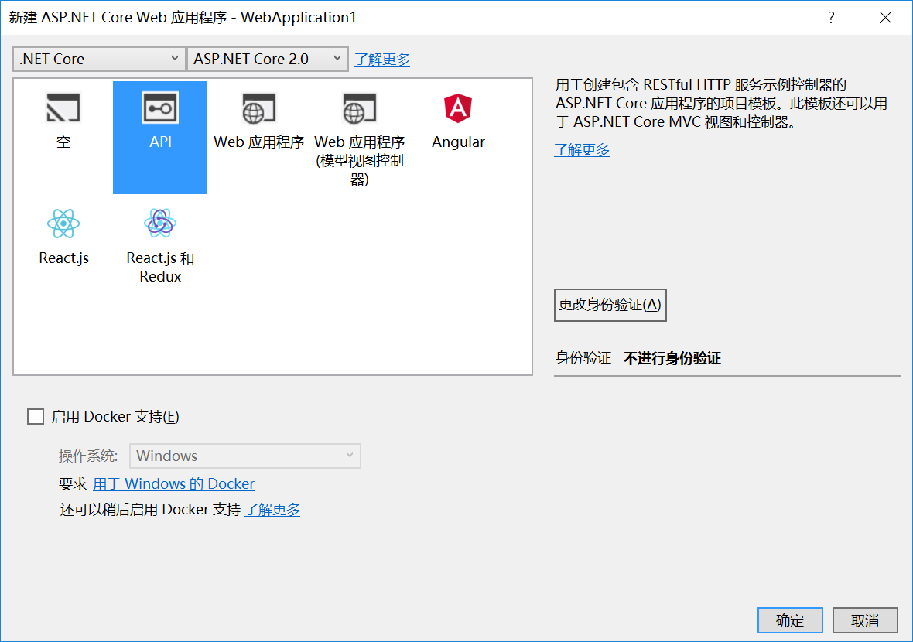

### 1.创建WebApi项目

vs2017创建.net core WebApi项目

新建=>项目=>Web=>Asp.net Core Web 应用程序=>Api





项目创建好了，直接F5启动 如果是IE为默认浏览器，那么浏览器会提示下载一个文件，这个文件里面其实就是一个 "value1", "value2" 字符串数据

如果是 其他浏览器打开，那么页面上就会显示   "value1", "value2"


这个东西是默认的路由**ValuesController** 的Get方法的返回值，也是webeapi给我们的一个控制器参考的例子


### 2.创建自己的控制器

```c#
public class UserController : Controller
 {
    public object GetUser()
    {
    	return new { Name = "123", Age = 18 };
    }
 }
```

这个时候用postman 模拟请求 ，都没什么问题

但是添加多个方法，那么请求就会各种404，问题在于默认的路由规则会匹配多个方法，所以就报错了

需要在方法名称上面加上Route跟请求类型（POST、Get等等）来区分请求的是哪个方法

```c#
public class UserController : Controller
{
  [Route("api/user/GetUser")]
  public object GetUser()
  {
    return new { Name = "123", Age = 18 };
  }

  [Route("api/user/GetUserByName/{name}")]
  [HttpGet]
  public object GetUserByName(string name)
  {
    return new { Name = name, Age = 18 };
  }


  [Route("api/user/AddUser")]
  [HttpPost]
  public IActionResult AddUser()
  {
    return Ok("OK");
  }

  [Route("api/user/AddUser2")]
  public object AddUser2([FromBody]User user)
  {
    return new { success = "true", message = "成功", data = user };
  }
}
```

特别要注意的是 带参数的get请求**GetUserByName** 如果没有再 Route里面的里面加入 参数的占位符，那么这个参数是穿不进来的

错误的写法是

```
[Route("api/user/GetUserByName")]
```

正确的写法

```
[Route("api/user/GetUserByName/{name}")]
```


