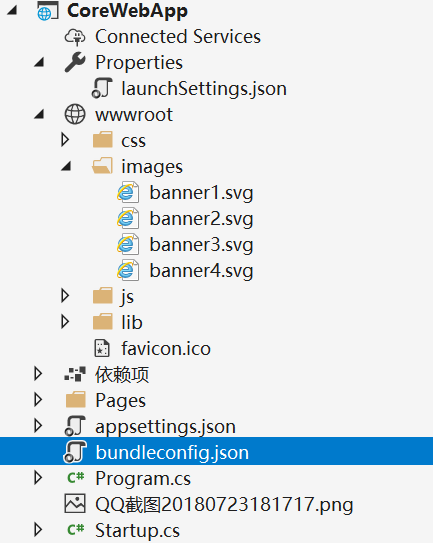
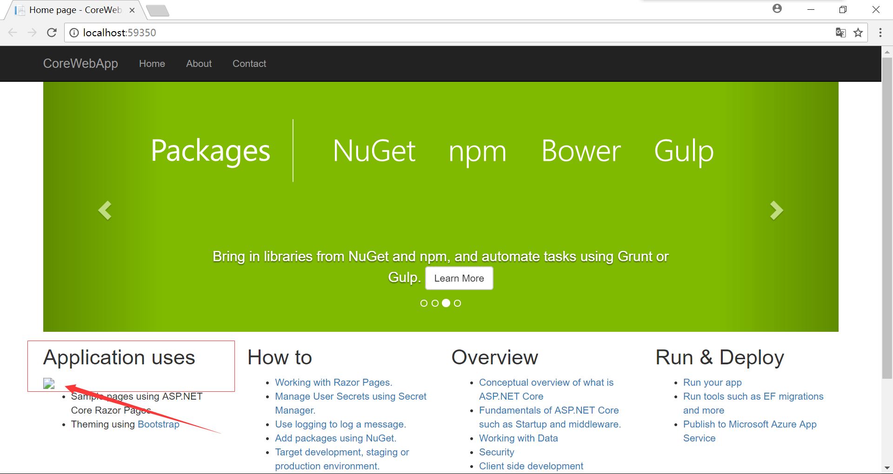
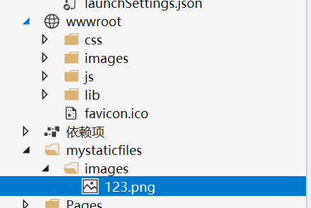

## ASP.NET Core 中的静态文件

静态文件（如 HTML、CSS、图像和 JavaScript）是 ASP.NET Core 应用直接提供给客户端的资产。 需要进行一些配置才能提供这些文件

新建一个.netCore Web应用程序

在项项目中**wwwroot** 目录就是一个默认的静态文件目录




启动项目，浏览器输入

```c#
http://localhost:59350/image/banner1.svg
```

就可以显示 wwwroot/image/banner1.svg 这张图片，只是.net core 自己配置好的，我们不用关系，如果要修改也可以，但是这里不去纠结


现在，假如我在根目录放入一张图**123.png**

浏览器输入:

```c#
http://localhost:59350/123.png
```


然后再试试在页面里面添加一个 **** 标签 看看能不能显示出来图片

在index.cshtml 中,Application uses 标题下面添加一个代码

```html
<h2>Application uses</h2>

<ul>
  <li>Sample pages using ASP.NET Core Razor Pages</li>
  <li>Theming using <a href="https://go.microsoft.com/fwlink/?LinkID=398939">Bootstrap</a></li>
</ul>
```



结果还是不显示


#### 自定义静态文件夹

添加一个新的文件目录 mystaticfiles




修改Startup.cs类中的Configure方法

```c#
app.UseStaticFiles();

app.UseStaticFiles(new StaticFileOptions
{
  FileProvider = new PhysicalFileProvider(
    Path.Combine(Directory.GetCurrentDirectory(), "mystaticfiles")),
  RequestPath = "/StaticFiles"//虚拟路径
});
```

注意：原有的app.UseStaticFiles();不要删了，不然默认根目录下的静态文件就无法加载了

修改index.cshtml,看看123.png能够显示,

这里有点需要注意的是，自定义的静态文件夹不是物理文件的文件夹而是设置的文件夹

错误的写法:

```html
<h2>Application uses</h2>

```


正确的写法:

```html
<h2>Application uses</h2>

```

同理，在浏览器中直接请求文件也是要用虚拟路径**StaticFiles**

如果没有设置虚拟访问路径

```c#
app.UseStaticFiles(new StaticFileOptions
{
  FileProvider = new PhysicalFileProvider(
    Path.Combine(Directory.GetCurrentDirectory(), "mystaticfiles"))
});
```

那么可以直接通过http://localhost:59351/images/123.png来访问


#### 设置http相应表头

修改Configure方法

```c#
app.UseStaticFiles(new StaticFileOptions
{
  FileProvider = new PhysicalFileProvider(
    Path.Combine(Directory.GetCurrentDirectory(), "mystaticfiles")),
  RequestPath = "/StaticFiles",
  OnPrepareResponse = ctx =>
  {
    ctx.Context.Response.Headers.Append("Cache-Control", "public,max-age=600");
  }
});
```

[HeaderDictionaryExtensions.Append](https://docs.microsoft.com/zh-cn/dotnet/api/microsoft.aspnetcore.http.headerdictionaryextensions.append) 方法存在于 [Microsoft.AspNetCore.Http](https://www.nuget.org/packages/Microsoft.AspNetCore.Http/) 包中

 然后用postman模拟请求

```c#
http://localhost:59351/StaticFiles/images/123.png
--查看返回值的headers
Accept-Ranges →bytes
Cache-Control →public,max-age=600
Content-Length →54134
Content-Type →image/png
Date →Wed, 25 Jul 2018 03:42:04 GMT
ETag →"1d4226e56e2eb76"
Last-Modified →Mon, 23 Jul 2018 10:17:20 GMT
Server →Kestrel
```

多了一个 **Cache-Control →public,max-age=600**

意思就是 可公开缓存文件600秒(10分钟)

[.netCore静态文件](https://docs.microsoft.com/zh-cn/aspnet/core/fundamentals/static-files?view=aspnetcore-2.1&tabs=aspnetcore2x)


